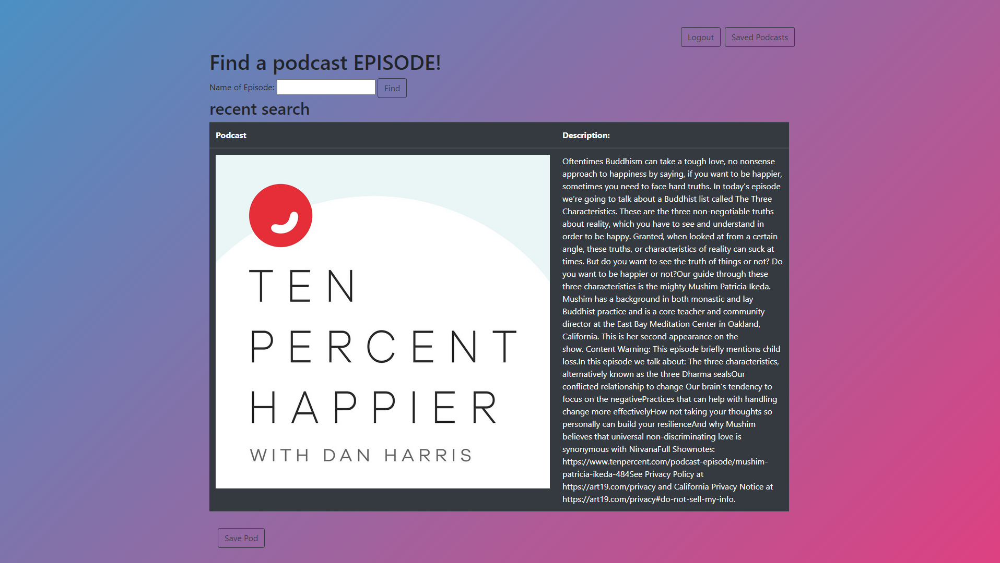
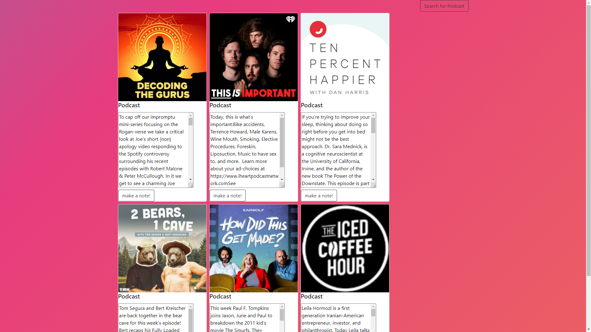
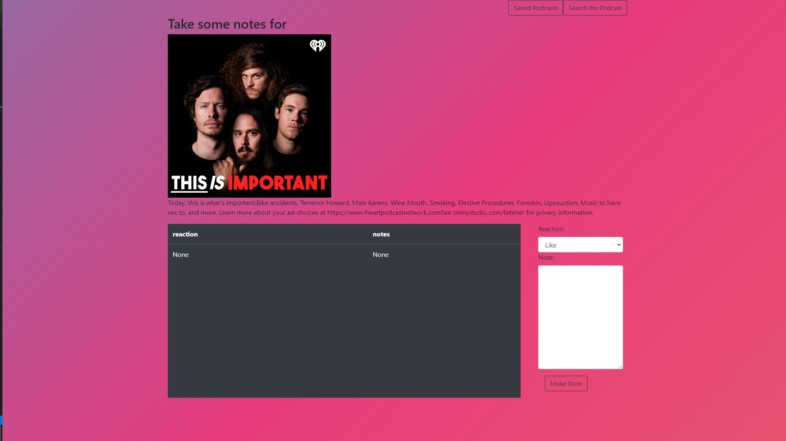

# NoteCast
App for building meaningful interactions through podcasts using: Python/Flask, MySQL, Spotipy

##### Search names of podcast episodes
Utilizes spotipy python library to make requests to Spotify Web API to fetch podcast data

##### Saving a podcast displays all of the saved podcasts
Displayed podcasts are displayed in bootstrap cards with an img of the podcast and a description

##### Creating a note for a podcast
notes are stored with a many to one relationship in the MySQL DB and displayed on a table below the podcast description when created

